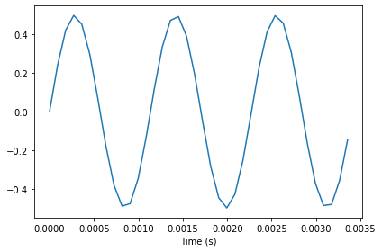

---
title:  "dsp"
permalink: /posts/2021/03/dsp-dude
date: 2021-03-21-02
----


```pythons
# Get thinkdsp.py

import os

if not os.path.exists('thinkdsp.py'):
    !wget https://github.com/AllenDowney/ThinkDSP/raw/master/code/thinkdsp.py
```

    --2021-03-22 14:37:36--  https://github.com/AllenDowney/ThinkDSP/raw/master/code/thinkdsp.py
    Resolving github.com (github.com)... 13.250.177.223
    Connecting to github.com (github.com)|13.250.177.223|:443... connected.
    HTTP request sent, awaiting response... 302 Found
    Location: https://raw.githubusercontent.com/AllenDowney/ThinkDSP/master/code/thinkdsp.py [following]
    --2021-03-22 14:37:36--  https://raw.githubusercontent.com/AllenDowney/ThinkDSP/master/code/thinkdsp.py
    Resolving raw.githubusercontent.com (raw.githubusercontent.com)... 185.199.108.133, 185.199.111.133, 185.199.110.133, ...
    Connecting to raw.githubusercontent.com (raw.githubusercontent.com)|185.199.108.133|:443... connected.
    HTTP request sent, awaiting response... 200 OK
    Length: 48687 (48K) [text/plain]
    Saving to: ‘thinkdsp.py’
    
    thinkdsp.py         100%[===================>]  47,55K  --.-KB/s    in 0,02s   
    
    2021-03-22 14:37:37 (2,12 MB/s) - ‘thinkdsp.py’ saved [48687/48687]
    


```python
# install a crpto package numpy
import sys
!{sys.executable} -m pip install matplotlib
```

    Defaulting to user installation because normal site-packages is not writeable
    Collecting matplotlib
      Downloading matplotlib-3.3.4-cp36-cp36m-manylinux1_x86_64.whl (11.5 MB)
         |████████████████████████████████| 11.5 MB 3.7 MB/s eta 0:00:01
    [?25hRequirement already satisfied: python-dateutil>=2.1 in /home/supernode/.local/lib/python3.6/site-packages (from matplotlib) (2.8.1)
    Requirement already satisfied: numpy>=1.15 in /home/supernode/.local/lib/python3.6/site-packages (from matplotlib) (1.19.5)
    Requirement already satisfied: pyparsing!=2.0.4,!=2.1.2,!=2.1.6,>=2.0.3 in /home/supernode/.local/lib/python3.6/site-packages (from matplotlib) (2.4.7)
    Collecting kiwisolver>=1.0.1
      Downloading kiwisolver-1.3.1-cp36-cp36m-manylinux1_x86_64.whl (1.1 MB)
         |████████████████████████████████| 1.1 MB 4.4 MB/s eta 0:00:01
    [?25hCollecting pillow>=6.2.0
      Downloading Pillow-8.1.2-cp36-cp36m-manylinux1_x86_64.whl (2.2 MB)
         |████████████████████████████████| 2.2 MB 429 kB/s eta 0:00:01
    [?25hCollecting cycler>=0.10
      Downloading cycler-0.10.0-py2.py3-none-any.whl (6.5 kB)
    Requirement already satisfied: six in /home/supernode/.local/lib/python3.6/site-packages (from cycler>=0.10->matplotlib) (1.15.0)
    Installing collected packages: pillow, kiwisolver, cycler, matplotlib
    Successfully installed cycler-0.10.0 kiwisolver-1.3.1 matplotlib-3.3.4 pillow-8.1.2


```python
from thinkdsp import CosSignal, SinSignal

cos_sig = CosSignal(freq=440, amp=1.0, offset=0)
sin_sig = SinSignal(freq=880, amp=0.5, offset=0)

```

plot sinyal sin dan cosinus. secara default plot memeliki tiga priode


```python
from thinkdsp import decorate

cos_sig.plot()
decorate(xlabel = 'Time (s)')
```


    

    


gambar di atas merupakan gambar sinyak sinus


```python
sin_sig.plot()
decorate(xlabel = 'Time (s)')
```


    

    


Gambar di atas memberitahu frekwensi dari sebuah sinyal sinus adalah double


```python

```
